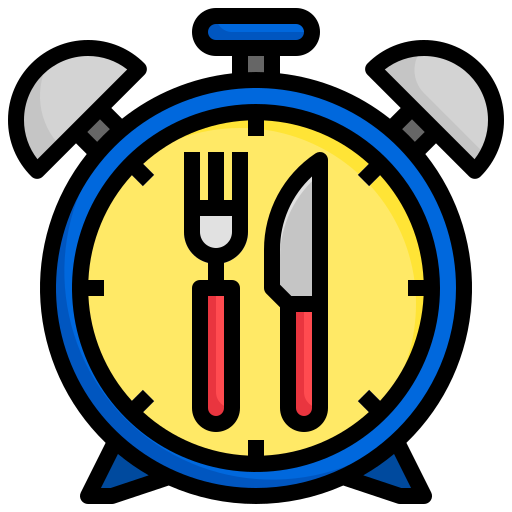

# Calculadora de Jejum Intermitente

Um aplicativo simples para calcular o período de jejum entre duas refeições ao longo do dia.

    

Pequeno projeto em JavaScript para calcular o tempo de jejum entre duas refeições ao longo do dia. Esta calculadora foi desenvolvida para ajudar na prática de jejum intermitente, oferecendo uma maneira fácil de determinar o intervalo entre a última e a primeira refeição do dia.

## Funcionalidades

***Calcular Tempo de Jejum:***
* Calcula o tempo de jejum entre a última refeição do dia anterior e a primeira refeição do dia atual.
* Leva em consideração casos onde o jejum pode atravessar a meia-noite.

***Seleção de Horas:***
* Permite ao usuário escolher a hora da última refeição e a hora da primeira refeição através de seletores.

***Exibição do Resultado:***
* Mostra o tempo de jejum calculado em horas.

## Como Utilizar

Abra o sistema [aqui](https://lauraperroni.github.io/intermittent-fasting-calculator/).
Para calcular o tempo de jejum:

1. Selecione a "Hora da última refeição" utilizando o menu suspenso.
2. Selecione a "Hora da primeira refeição" utilizando o menu suspenso.
3. Clique no botão "Calcular" para ver o tempo de jejum calculado.
4. O resultado será exibido abaixo do botão "Calcular".

Com esta calculadora, você pode monitorar e registrar seu tempo de jejum intermitente, ajudando a alcançar seus objetivos de saúde e bem-estar de maneira organizada e eficiente.